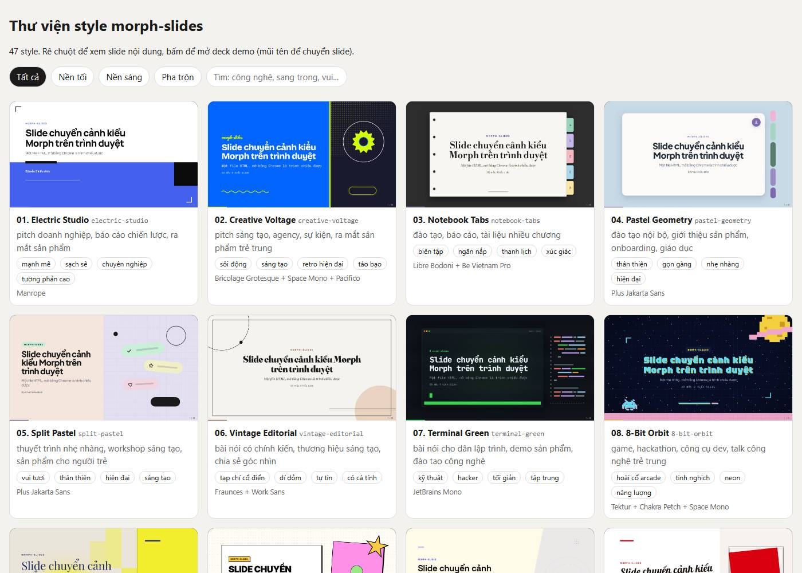

# morph-slides

Skill cho [Claude Code](https://claude.com/claude-code) tạo **slide HTML có hiệu ứng chuyển cảnh kiểu PowerPoint Morph**: hình trang trí trượt, phóng to, đổi màu liền mạch giữa các slide. Một file HTML, mở bằng Chrome là trình chiếu được. Có **47 style**, bố cục tự lấp đầy theo lượng chữ và tự đo độ trống của từng slide.

*A Claude Code skill that builds single-file HTML decks with PowerPoint-Morph-like transitions: 47 styles, auto-filling layouts and an automatic fill/overflow audit. Docs are in Vietnamese.*

**Xem trực tuyến:** [Thư viện 47 style](https://andyluu98.github.io/morph-slides/gallery/00-gallery.html) · [Deck mẫu 20 slide (Stencil & Tablet)](https://andyluu98.github.io/morph-slides/examples/ai-agent-stencil-tablet-20-slide.html) · [Deck mẫu 15 slide (Swiss Modern)](https://andyluu98.github.io/morph-slides/examples/ai-agent-swiss-15-slide.html)



## Cơ chế trong một câu

Mỗi style có một nhóm hình cố định gọi là **diễn viên**. Mỗi kiểu slide (bìa, mục lục, nội dung, hai cột...) quy định một **tư thế** cho các diễn viên. Khi chuyển slide, trình duyệt cho diễn viên trượt dần sang tư thế mới, đúng tinh thần Morph: cùng tên là cùng một vật.

## Tính năng

- **47 style:** 12 preset và 34 bold template phỏng theo [frontend-slides](https://github.com/zarazhangrui/frontend-slides), cộng 1 style tái tạo mẫu Morph "vòng tròn xanh". Mọi font đều có bộ chữ tiếng Việt.
- **9 kiểu slide:** cover, agenda, section, content, two-col, stats, timeline, quote, closing.
- **Tự lấp đầy:** engine đếm số ý trên slide rồi chọn cỡ chữ lớn, vừa hoặc nhỏ. Slide nội dung có ô điểm nhấn, slide hai cột có câu kết luận.
- **Không lặp nhàm:** cùng một kiểu slide xuất hiện nhiều lần sẽ đổi dáng (biến thể 1, 2, 3) và đổi hướng chữ vào khung.
- **Chữ bay giữa hai slide (FLIP):** ví dụ tiêu đề mục ở trang mục lục bay sang thành tiêu đề phần.
- **Tự kiểm tra:** `check-deck.py` chụp mọi slide, gom thành một ảnh, đo khoảng trống và chữ tràn, bắt lỗi console.
- **Không phụ thuộc thư viện:** chỉ HTML, CSS, JavaScript thuần. Có chế độ giảm chuyển động.

## Cài đặt

```bash
git clone https://github.com/andyluu98/morph-slides.git
cp -r morph-slides/skill/morph-slides ~/.claude/skills/
pip install -r morph-slides/requirements.txt
playwright install chromium
```

Python chỉ cần cho các script kiểm tra và đóng gói. Deck tạo ra chạy được trên mọi trình duyệt hiện đại mà không cần Python.

## Cách dùng

Trong Claude Code, gõ `/morph-slides` hoặc nói tự nhiên, ví dụ: *"Làm 20 slide giải thích AI Agent, style stencil-tablet"*. Skill sẽ lập dàn ý, chọn kiểu slide, dựng deck, tự kiểm tra rồi đóng gói thành một file HTML.

Dùng thủ công không qua Claude:

1. Chép `skill/morph-slides/templates/deck-mau.html`, đổi dòng `<link>` sang style muốn dùng (danh sách ở `assets/styles/index.json`).
2. Thay nội dung các `<section class="slide" data-layout="...">` (markup mẫu ở `references/layouts.md`).
3. Đóng gói: `python scripts/inline-assets.py nguon.html deck.html`
4. Kiểm tra: `python scripts/check-deck.py deck.html thu-muc-anh`

**Trình chiếu:** mũi tên hoặc Space để sang slide, mũi tên trái để lùi, `F` toàn màn hình, `Home`/`End` về đầu/cuối.

## Cấu trúc

```
skill/morph-slides/
├── SKILL.md                 quy trình cho Claude
├── assets/
│   ├── morph-engine.js      co giãn khung, diễn viên, biến thể, FLIP
│   ├── morph-nav.js         phím, click, vuốt, cuộn chuột
│   ├── morph-audit.js       deck.audit(): đo khoảng trống và chữ tràn
│   ├── morph-base.css       khung 1920x1080, chuyển cảnh, hiệu ứng chữ
│   ├── morph-layouts.css    9 kiểu slide tự co giãn
│   └── styles/              47 style + index.json
├── references/              cơ chế, layout, công thức chuyển cảnh, chọn style, font tiếng Việt
├── scripts/                 inline-assets.py, check-deck.py, build-gallery.py
└── templates/deck-mau.html  deck mẫu 10 slide đủ 9 kiểu
examples/                    2 deck mẫu về AI Agent
gallery/                     00-gallery.html + 47 deck demo
```

## Ghi nguồn

Các style phỏng theo [frontend-slides](https://github.com/zarazhangrui/frontend-slides) của Zara Zhang (MIT). Icon từ [Lucide](https://lucide.dev) (ISC). Font tải từ Google Fonts (SIL Open Font License). Chi tiết ở [THIRD_PARTY.md](THIRD_PARTY.md).

## Giấy phép

[MIT](LICENSE)
